# 設計関連

## ドメインモデル図

※`mmdc -i docs/domain_modeling.mmd -o docs/domain_modeling.svg` により生成

なお、モデル図に表せないドメインルールは以下に示す。

- Circle: サークル作成者が自動的にオーナーとなる
- Circle: サークルメンバー数は最大で30人まで
- CirclePermission: 権限の変更はオーナーのみ可能
- Board: オーナーもしくは権限付与されたサークルのメンバーのみ作成可能
- Board: 投稿は掲示板ごとに最大100件まで

## ER図

`circle-service`に関連するDBのER図は以下の通り。

※`mmdc -i docs/er.mmd -i docs/er.svg` により生成
